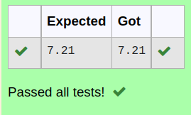

# DISTANCE-BETWEEN-TWO-POINTS

## AIM:
To write a python program to find the distance two 2 points
## ALGORITHM:
### Step 1: import math package
### Step 2: input number 1
### Step 3: input number 2 Substitute the values in the distance formula formula
### Step 4: formula : distance = math.sqrt(((l2[0]-l1[0])**2)+((l2[1]-l1[1])**2))
### Step 5: print the distance in two decimal
### PROGRAM:
 ```python
  #Program to find the distance between two points.
#Developed by: S.E.Elamaran
#RegisterNumber:22000420
import math
x1=[4,2]
x2=[10,6]
distance=math.sqrt(((x2[0]-x1[0])**2)+((x1[1]-x2[1])**2))
res="{:.2f}".format(distance)
print(res)
```


### OUTPUT:


### RESULT:
This program is used to find the distance between two points
